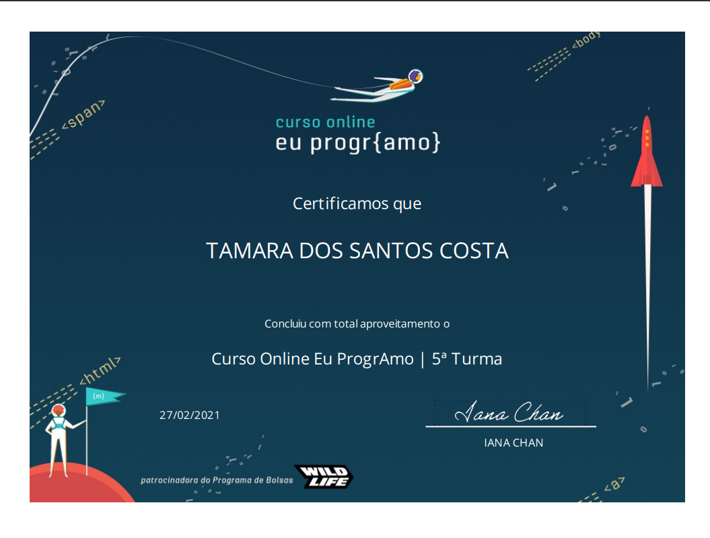
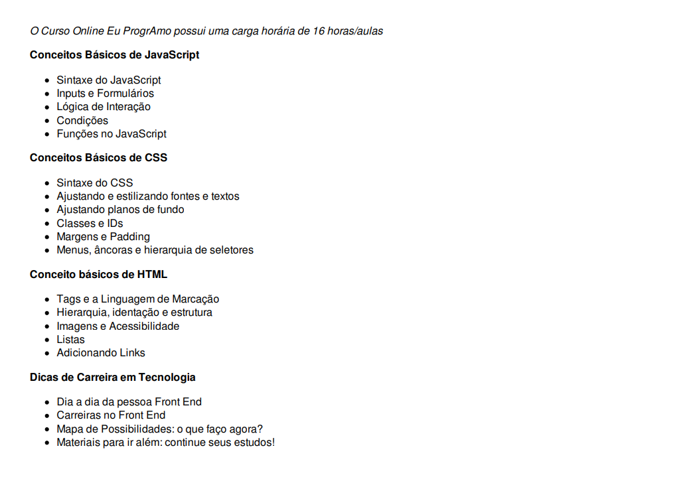

# SITE ADA LOVELACE
Ada foi a primeira pessoa a escrever um algoritmo para ser processado por uma máquina na história da computação.

## SOBRE O SITE
O desenvolvimento desse site fez parte do prograMaria, uma iniciativa que capacita mulheres para o mercado de TI. O layout, cores já eram definidas pelo programa.

### CERTIFICADO

